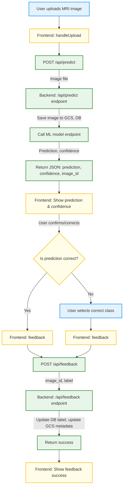

```mermaid
flowchart TD
    %% Prediction Flow
    A1[User uploads MRI image]
    A2[Frontend: handleUpload]
    A3[POST /api/predict]
    B1[Backend: /api/predict endpoint]
    B2[Call ML model endpoint]
    B3[Return JSON: prediction, confidence, image_id]
    A4[Frontend: Show prediction & confidence]

    A1 --> A2
    A2 --> A3
    A3 -- Image file --> B1
    B1 -- Save image to GCS, DB --> B2
    B2 -- Prediction, confidence --> B3
    B3 --> A4

    %% Feedback Flow
    C1{Is prediction correct?}
    C2[Frontend: feedback]
    C3[User selects correct class]
    C4[Frontend: feedback]
    D1[POST /api/feedback]
    D2[Backend: /api/feedback endpoint]
    D3[Return success]
    A5[Frontend: Show feedback success]

    A4 -- User confirms/corrects --> C1
    C1 -- Yes --> C2
    C1 -- No --> C3
    C3 --> C4
    C2 --> D1
    C4 --> D1
    D1 -- image_id, label --> D2
    D2 -- Update DB label, update GCS metadata --> D3
    D3 --> A5

    %% Styling
    classDef userAction fill:#e3f2fd,stroke:#2196f3,stroke-width:2px;
    classDef frontend fill:#fffde7,stroke:#fbc02d,stroke-width:2px;
    classDef backend fill:#e8f5e9,stroke:#388e3c,stroke-width:2px;
    class A1,C3 userAction;
    class A2,A4,C1,C2,C4,A5 frontend;
    class A3,B1,B2,B3,D1,D2,D3 backend;
```
